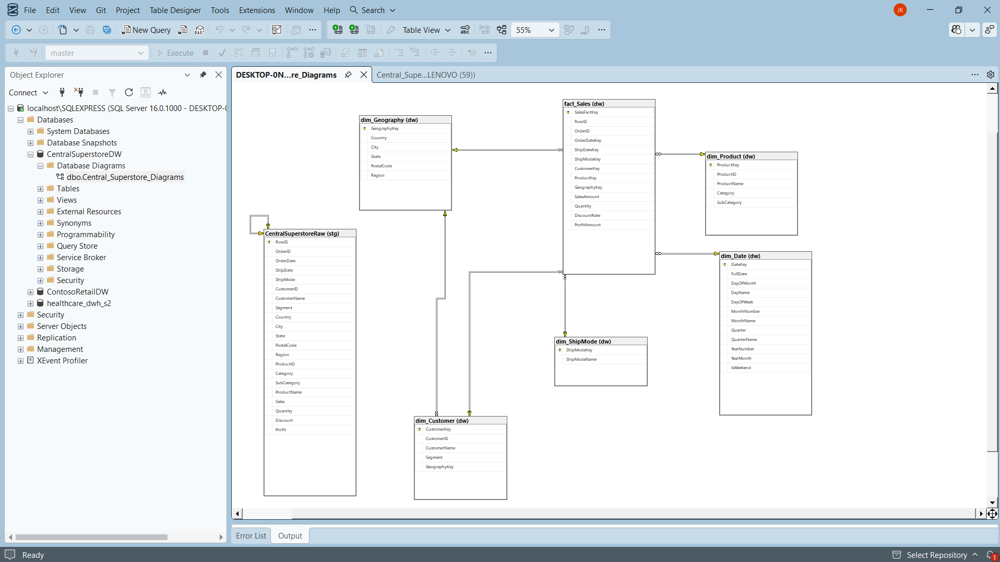

# Central Superstore Data Warehouse

A SQL Server data warehouse and business analytics solution built from the Central region Superstore sales dataset (MiniProject 2).



## Overview

Raw order data is loaded into a staging table, then normalized into a **star schema** with one fact table and five dimensions. The project also includes indexing and query optimization, analytical queries, a reporting view, a stored procedure, and executive reporting queries.

## Star Schema

| Table | Type | Description |
|---|---|---|
| `fact_Sales` | Fact | One row per order line |
| `dim_Customer` | Dimension | Customer details and segment |
| `dim_Product` | Dimension | Product, category, sub-category |
| `dim_Geography` | Dimension | Country, region, state, city, postal code |
| `dim_Date` | Dimension | Calendar attributes |
| `dim_ShipMode` | Dimension | Shipping method |

Schemas used: `stg` (staging), `dw` (warehouse), `rpt` (reporting).

## Repository Structure

```
├── central_superstore_dw.sql   # Full T-SQL script (sections 1-10)
├── Central_Superstore.csv     # Source dataset (CSV)
├── Central_Superstore.xlsx    # Source dataset (Excel)
├── star_schema_diagram.png    # Schema diagram
├── .gitignore
├── LINCESE
└── README.md
```

## Script Sections

1. Database setup
2. Data warehouse design notes
3. Table creation (staging + star schema)
4. Performance optimization and query optimization notes
5. Business analytics queries
6. Advanced SQL summary
7. SQL view
8. Stored procedure
9. Executive reporting
10. Documentation summary

## Getting Started

1. Open `sql/central_superstore_dw.sql` in SQL Server Management Studio or Azure Data Studio.
2. Load `data/Central_Superstore.csv` into `stg.CentralSuperstoreRaw` (for example with the Import Wizard).
3. Execute the script section by section.

## Tech Stack

Microsoft SQL Server (T-SQL), Excel/CSV source data.

## Author

Jowairya Kassem
